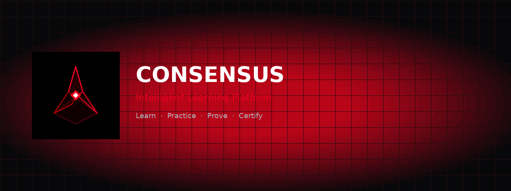
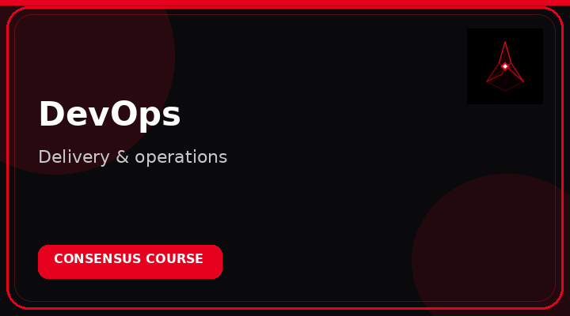
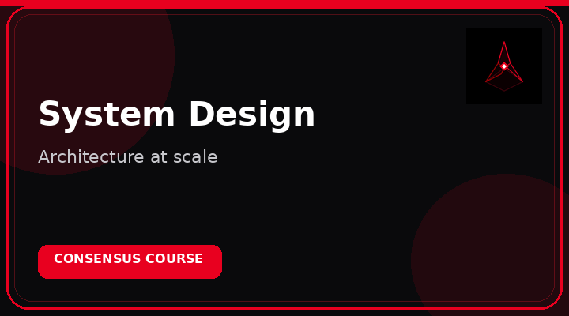

<div align="center">


# CONSENSUS

### Intelligent Learning Platform

**Master real skills. Practice with purpose. Prove what you know.**

<br/>

[](https://consensus.codes)
[](https://consensus.codes/courses)

<br/>



</div>

---

<div align="center">

### Learning that feels serious — and actually sticks

A modern LMS for builders: structured courses, hands-on labs, focused exams, and credentials that matter.

</div>

---

## Featured courses

<div align="center">

| | |
| :---: | :---: |
| <a href="https://consensus.codes/courses"></a> | <a href="https://consensus.codes/courses"></a> |
| <a href="https://consensus.codes/courses"></a> | <a href="https://consensus.codes/courses"></a> |
| <a href="https://consensus.codes/courses"></a> | <a href="https://consensus.codes/courses"></a> |

<br/>

**And more tracks built for real-world tech careers.**

[Explore the full catalog →](https://consensus.codes/courses)

</div>

---

## The Consensus path

```text
  LEARN          PRACTICE         PROVE            SHOWCASE
  ─────          ───────          ─────            ────────
  Courses   →    Labs        →    Exams      →     Certificates
```

| Courses | Labs | Exams | Certificates |
| :---: | :---: | :---: | :---: |
| Structured lessons | Hands-on practice | Skill validation | Shareable proof |

- **Self-paced** — learn on your schedule  
- **Focused modes** — deep work without noise  
- **Learning paths** — multi-course journeys  
- **Clear progress** — always know what’s next  

---

## Skills you'll build

<div align="center">

&nbsp;&nbsp;
&nbsp;&nbsp;
&nbsp;&nbsp;
&nbsp;&nbsp;
&nbsp;&nbsp;
&nbsp;&nbsp;
&nbsp;&nbsp;
&nbsp;&nbsp;
&nbsp;&nbsp;


<br/><br/>

**Linux · Git · JavaScript · React · Python · DevOps · System Design**

</div>

---

## Built for ambition

<div align="center">

| Students | Self-learners | Builders |
| :---: | :---: | :---: |
| Structure that compounds | Flexible, serious skill growth | Practice that transfers to real work |

</div>

---

<div align="center">

## Ready when you are

### [Start on consensus.codes →](https://consensus.codes)

<br/>


**CONSENSUS**  
*Intelligent Learning Platform*

[Website](https://consensus.codes) · [Courses](https://consensus.codes/courses) · [Labs](https://consensus.codes/labs) · [Exams](https://consensus.codes/exams)

<br/>

<sub>Learn. Build. Reach Consensus.</sub>

</div>
